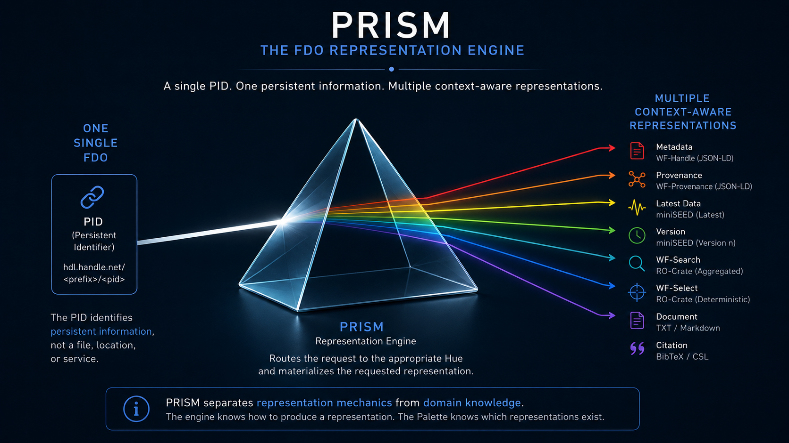

# PRISM
## The FDO Representation Engine

> **One FAIR Digital Object**
>
> Multiple coherent representations.
>

<p align="center">
  
</p>

---

# Why PRISM Exists

Traditional Persistent Identifier resolvers were primarily designed to resolve identifiers into resources.

```
PID
 │
 ▼
URL
 │
 ▼
Resource
```

This approach has served the research community for decades.

Modern **FAIR Digital Objects (FDOs)**, however, expose much richer information than a single downloadable resource.

The same FAIR Digital Object may provide:

- metadata;
- provenance;
- multiple versions;
- waveform subsets;
- documentation;
- RO-Crates;
- citations;
- open to future domain-specific representations.

Each of these exposes a different view of the same FAIR Digital Object.

The role of a modern resolver therefore extends beyond locating a resource.

Its role is to **materialize the most appropriate representation of a FAIR Digital Object** according to the client's context.

This is the purpose of PRISM.

---

# From Resolution to Representation

PRISM extends traditional PID resolution into **representation-aware resolution**.

Instead of asking

> "Where is the resource?"

clients ask

> "Which representation of this FAIR Digital Object do I need?"

Traditional Resolver

```
PID
 │
 ▼
Resource
```

PRISM

```
PID
 │
 ▼
FAIR Digital Object
 │
 ▼
Representation Engine
 │
 ├── Metadata
 ├── Provenance
 ├── Waveforms
 ├── Citations
 ├── Documentation
 └── Future Representations
```

A single PID.

Multiple coherent representations.

One FAIR Digital Object.


---

# Architecture

PRISM intentionally separates **execution mechanics** from **representation knowledge**.

Execution is performed by the Representation Engine.

Representation knowledge is provided by the Palette.


```
Representation Engine
            │
            ▼
         Palette
```

The Representation Engine knows **how** to execute.

The Palette knows **which representations** exist for a particular scientific domain.

This separation allows new representations to be introduced without modifying the engine itself.

---

# The Representation Engine

The Representation Engine is responsible for:

- request dispatching;
- representation routing;
- Hue loading;
- workflow orchestration;
- configuration management;
- logging.

The engine remains completely independent of domain-specific logic.

Its responsibility is simply to execute the workflow required to produce a representation.

```
HTTP Request
      │
      ▼
    Prism
      │
      ▼
 Select Hue
      │
      ▼
Execute Hue
      │
      ▼
Representation
```

---

# The Palette

A Palette defines the representation capabilities of a scientific domain.

It contains:

- Hues;
- Modules;
- Schemas;
- domain-specific configuration.

A Palette evolves independently from the Representation Engine.

Adding a new representation requires extending the Palette — not modifying the Representation Engine.

> **The Representation Engine executes.**
>
> **The Palette defines the representations.**

---

# Hues

A Hue is responsible for producing exactly one representation.

Typical examples include:

- WF-Handle
- WF-Provenance
- Latest miniSEED
- Version miniSEED
- WF-Search
- WF-Select
- Documentation
- Citation

Every Hue follows the same execution contract.

```
Parse Request
      │
Validate Request
      │
Retrieve Domain Information
      │
Build Representation
      │
Send Representation
```

Hues orchestrate the workflow.

Each Hue is intentionally independent from every other Hue.

Infrastructure and reusable capabilities are delegated elsewhere.

---

# Modules

Modules provide reusable domain capabilities shared by multiple Hues.

Typical responsibilities include:

- metadata access;
- provenance retrieval;
- archive loading;
- waveform slicing;
- format conversion;
- validation;
- RO-Crate generation.

Modules provide capabilities.

They do not define workflows.

> **Hues describe the workflow.**
>
> **Modules perform the work.** _(A Module may be reused by multiple Hues)_

---

# Representation Pipeline

Every representation request follows the same execution model.

```
Client
   │
   ▼
Persistent Identifier
   │
   ▼
PRISM
   │
   ▼
Hue
   │
   ▼
Modules
   │
   ▼
Representation
```

Only the selected Hue changes.

The Representation Engine remains the same.

---

# Extending PRISM

Adding new representations never requires modifications to the Representation Engine.

The recommended workflow is intentionally simple.

```
Create a new Hue
        │
        ▼
Implement the workflow
        │
        ▼
Reuse existing Modules
        │
        ▼
Register the Hue
        │
        ▼
Representation immediately available
```

The engine remains stable.

Only the Palette evolves.

---

# Design Principles

PRISM follows the same design philosophy described by the [Bicycle Principle](https://github.com/INGV/rum-framework/blob/main/BICYCLE.md).

- One Hue, one representation.
- Hues orchestrate workflows.
- Modules provide reusable capabilities.
- Infrastructure remains independent from domain knowledge.
- New representations should be added as new Hues.
- Generalize only after reuse naturally appears.
- Discover abstractions rather than inventing them.

---

# Looking Forward

The current Palette already provides multiple representations.

Future Hues may introduce:

- GeoJSON
- EPOS DCAT-AP
- NetCDF
- HTML
- PNG previews
- AI-generated summaries
- domain-specific visualizations
- future scientific representations

The Representation Engine remains unchanged.

Only the Palette grows.

---

# Final Principle

FAIR Digital Objects are intended to remain persistent while technologies continue to evolve.

PRISM embraces this principle by separating a FAIR Digital Object from the technologies used to represent it.

> **Technology changes.**
>
> **Information continues the journey.**

---