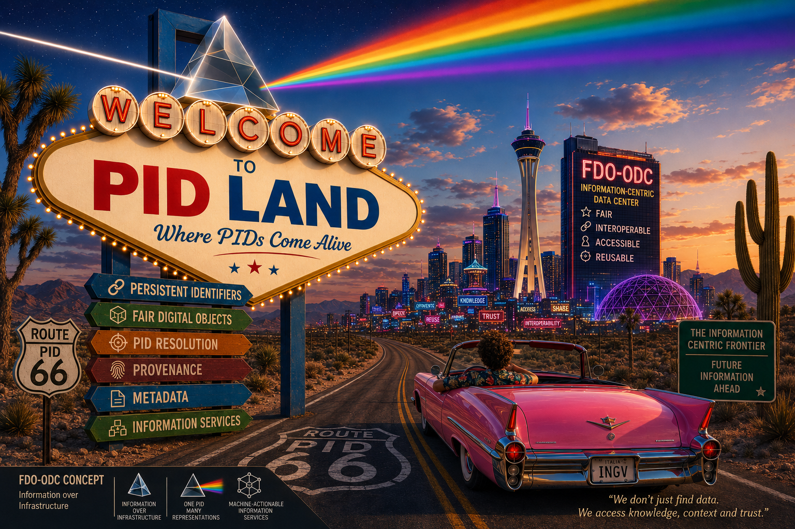
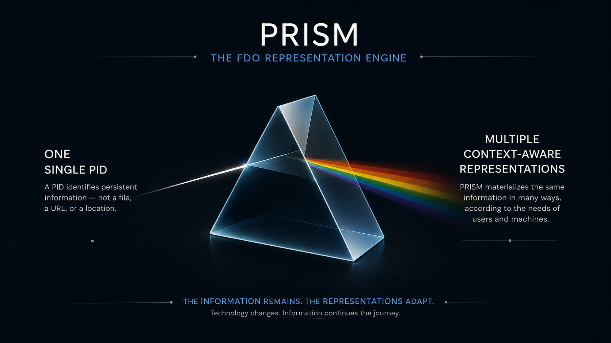

# PID-LAND

 <p align="center">
  
 </p>

> PID-LAND represents the visible layer of a FAIR Digital Object-Oriented Data Center (FDO-ODC):
>
> an ecosystem where Persistent Identifiers resolve FAIR Digital Objects into machine-actionable information services rather than simply locating digital resources.

## Overview

PID-LAND is an **Information Representation Engine** that transforms Persistent Identifier resolution into the materialization of **context-aware representations** of FAIR Digital Objects.

Rather than simply locating digital resources, PID-LAND provides machine-actionable access to multiple coherent representations
— including metadata, provenance, waveform data, documentation, citable references, and future domain-specific representations — while preserving the identity of the underlying FAIR Digital Object.

Each representation exposes a different view of the same FAIR Digital Object.

The information remains persistent.

Representations are materialized on demand.

> **Note**
>
> The repository is currently undergoing an internal architectural refactoring that introduces the concepts described in this document (PRISM, Palette, Hues and Modules).
>
> The public interfaces and the underlying concepts remain unchanged; the ongoing work focuses on improving the internal organization of the implementation.
> 
---

# From Resolution to Representation

Traditional PID resolution follows a resource-centric model.

```
PID
 │
 ▼
URL
 │
 ▼
Resource
```

PID-LAND adopts a representation-centric approach.

```
PID
 │
 ▼
FAIR Digital Object
 │
 ▼
PRISM Representation Engine
 │
 ├── Metadata
 ├── Provenance
 ├── Waveforms
 ├── Citations
 ├── Documentation
 └── Future Representations
```

A single PID.

Multiple coherent representations.

One FAIR Digital Object.

---
# The Representation Engine Approach (_PRISM concept_)

PRISM builds upon the FAIR Digital Object model to explain how a FAIR Digital Object may expose multiple independent representations.

It explains, moreover,  how the information associated with a FAIR Digital Object remains stable while its representations evolve independently.

Within PID-LAND:

- a PID identifies a FAIR Digital Object;
- the associated information remains persistent;
- representations are materialized according to the requested context.

Representations may differ in:

- purpose;
- format;
- level of abstraction;
- delivery protocol.

The identity of the FAIR Digital Object never changes.

Only its representations evolve.


>  <p align="center">
>  
>  </p>
>
> <p align="center">
>  <b>A PID identifies a FAIR Digital Object.</b>
> </p>
> <p align="center">
> <b>PRISM materializes context-aware representations of FDO.</b>
> </p>
---


## Resolver Architecture

### Single Resolver Endpoint
PID-LAND exposes a single, stable **public resolver endpoint**:


```
https://hdl.handle.net/<prefix>/<pid>
```


The PID (`<prefix>/<pid>`) always identifies the same FAIR Digital Object.

It never encodes:

- file paths
- storage locations
- backend services
- access protocols
- representation formats


### Public vs. Project Endpoint


While `hdl.handle.net` (or other global resolver) provides a **universal, public entry point**, all actual data and services are hosted on the project (local) infrastructure with specific endpoint (e.g., `https://my-resolver.net`).


When a user resolves the PID via `hdl.handle.net` (or other global resolver), the resolver performs a **redirect to the project-specific endpoint**:


```
User -> https://hdl.handle.net/<prefix>/<pid> -> redirect to -> PID-LAND (local resolver) ->  https://my-resolver.net/<prefix>/<pid>
```


This approach ensures:


- The PID remains **persistent and stable**.
- The underlying storage, service, or protocol can change without breaking the PID.
- Users always access the **FAIR digital object** without needing to know internal infrastructure details.

---

### Information-Centric Design Rationale

Traditional data services often adopt a **system-centric** approach, where identifiers are tightly coupled to specific services, storage locations, or representations. This typically leads to:

* Different URLs for data, metadata, and provenance
* Fragmentation of identifiers
* Reduced long-term persistence and interoperability

PID-LAND deliberately follows an **information-centric approach**, 
where the PID is the stable reference and systems and services are interchangeable. 
Representations can evolve without breaking identifiers and independent of:

* Storage backends
* File paths
* Software components
* Representation formats

This design aligns with established PID infrastructures (Handle, DOI) and extends them toward **FAIR Digital Objects**.

---

## Resolver Contract and Representations

PID-LAND implements a clear **resolver contract**: different representations are obtained by specifying the requested view through the `urlappend` parameter.

| Resolution request                     | Resulting representation                      |
|----------------------------------------|-----------------------------------------------|
| `<prefix>/<pid>`                       | Default view (latest dataset state) (MSEED)   |
| `<prefix>/<pid>?urlappend=?q=metadata` | WF Handle metadata (JSON-LD)                  |
| `<prefix>/<pid>?urlappend=?q=provenance`  | WF Provenance record (JSON-LD)                |
| `<prefix>/<pid>?urlappend=?q=version=<n>` | Specific historical version  (MSEED)          |
| `<prefix>/<pid>?urlappend=?q=document`    | Human readble documentation  (TXT)       |
| `<prefix>/wf-search?urlappend=?q=...`               | Aggregated dataset (WF-Manifest, RO-Crate)    |
| `<prefix>/wf-select?urlappend=?q=...`               | Deterministic dataset (WF-Manifest, RO-Crate) |

All views are resolved from the **same identifier**, ensuring semantic coherence between data, metadata, and provenance.

---


## View Selection via `urlappend`

All representations—static or query-derived are selected using the same resolution mechanism:

```
<prefix>/<pid>?urlappend=<view>
```

Supported views include:

* `metadata` → WF Handle
* `provenance` → WF Provenance
* `data` → waveform files (default)
* `document` → readable documentation

special pid
* `search` → WF-Manifest 
* `select` → WF-Manifest 

This uniform contract ensures that identifier semantics remain stable while representations evolve.

---
# Seismological Use Case

---

The seismological use case provides a practical example of how PID-LAND operates.

---

### WF-Handle: what the data is

**WF Handle** is a **JSON Schema** designed to describe **Information-centric metadata**
for waveform digital objects.

It represents the **information core** of the PID-LAND architecture and provides
a **machine-actionable, FAIR-compliant description** of waveform digital objects,
independently of storage systems or delivery services.

WF Handle focuses on **what the data is**, while complementary schemas
**WF Provenance** describe **how the data was produced**.

Repository: https://github.com/INGV/wf-handle

#### Example:
```
https://hdl.handle.net/11099/be9b7af6-f71f-11ee-aae9-0242ac120004?urlappend=?q=metadata
```

---

### WF-Provenance: how the data was generated

**WF Provenance** is a **JSON Schema** designed to describe **workflow-level provenance information**
for waveform digital objects.

It is a core component of the **PID-LAND** ecosystem and complements the
**WF Handle** schema by providing a structured, machine-actionable description of
**data lineage, versioning, and processing history**.

The schema is intended for **public use**, **automatic validation**, and
**long-term traceability** of waveform digital objects.

Repository: https://github.com/INGV/wf-provenance


#### Example:
```
https://hdl.handle.net/11099/be9b7af6-f71f-11ee-aae9-0242ac120004?urlappend=?q=provenance
```

---


### Data: binary payload

In the seismological domain, the data component typically consists of timestamped 
ground motion samples stored in **miniSEED** (mSEED) **format**, a widely recognized 
standard within the International Federation of Digital Seismograph Networks (FDSN).


#### Example:
```
https://hdl.handle.net/11099/be9b7af6-f71f-11ee-aae9-0242ac120004
```

---


### Document: plain text data description

A human-readable description of the data, particularly the miniSEED format currently used for waveform distribution.


#### Example:
```
https://hdl.handle.net/11099/be9b7af6-f71f-11ee-aae9-0242ac120004?urlappend=?q=document
```

---

## Special PIDs: Queries as Persistent Objects

PID-LAND introduces the concept of **Special PIDs**, extending persistent identification beyond static datasets.

A **Special PID** identifies a **query-defined dataset**, rather than by a pre-existing stored object.

In this model:

* the selection logic defines the object
* the PID identifies that logic
* resolution materializes a dataset view

> **The query itself becomes a persistent, citable object.**

Special PIDs are **not API calls**. They are persistent identifiers whose resolution produces a reproducible dataset derived from well-defined criteria.

---

### Conceptual Model of a Special PID

A Special PID:

* represents a stable conceptual dataset
* resolves through the same PID-LAND endpoint
* produces a materialized dataset view
* maintains explicit links to WF Handle metadata and WF Provenance records
* remains machine-actionable and FAIR-compliant

Although resolution is dynamic, the identified object is **conceptually stable**.

> Using: asof= 'date' 
> the resolver reconstructs the state of datasets valid at a specific point in time, allowing reproducible retrieval even when underlying datasets evolve.

---


### WF-Manifest: Materialized Dataset Views

When a Special PID is resolved, PID-LAND generates a **WF-Manifest**, a structured dataset representation encoded as an **RO-Crate JSON-LD**.

The WF-Manifest:

* represents the output of a query-defined conceptual object
* aggregates waveform files as `MediaObject` entities
* links each file to its metadata and provenance
* is fully machine-actionable and FAIR-compliant

WF-Manifest is **not a separate service**, but the natural consequence of resolving a Special PID.

Repository: https://github.com/INGV/wf-manifest

---


## Machine-Actionable by Design

All resolver outputs are:

* encoded in **JSON-LD**
* validated with **JSON Schema**
* constrained using **SHACL**

This guarantees structural validity, semantic consistency, and seamless automation across workflows.

---

## Examples

### WF-Search: Spatial and Temporal Selection

```
https://hdl.handle.net/11099/wf-search?urlappend=?q=/lat/40.7867/lon/15.9427/rad/10/start/2024-04-09/end/2024-04-10
```

Resolves to an aggregated RO-Crate manifest describing all matching waveform objects.

Typical use cases include regional discovery, event-based analysis, and automated data packaging.

---

### WF-Select: Deterministic Waveform Selection

```
https://hdl.handle.net/11099/wf-select?urlappend=?q=/net/IV/sta/ACER/loc//cha/HNE/start/2024-04-08/end/2024-04-10
```

Resolves to a deterministic dataset view, suitable for reproducible scientific workflows.

---
### Independent FAIRness Assessment

To test the architectural and operational evaluation presented here, output PID-LAND objects could be assessed using the F-UJI Automated FAIR Data Assessment Tool available [Here](https://www.f-uji.net)

Rather than emphasizing the numerical FAIRness score itself, the evaluation demonstrates that Persistent Identifiers within PID-LAND act as machine-actionable entry points to an information ecosystem whose FAIR characteristics can be objectively recognized by an independent assessment framework.

---

# Technical Information

PID-LAND demonstrates how Persistent Identifiers can become stable entry points to FAIR Digital Object rather than to individual resources.

By separating FAIR Digital Objects from their possible representations, the same FAIR Digital Object can be materialized through multiple coherent views while remaining independent of storage systems, software components, transport protocols, and evolving technologies.

---


# Internal Architecture

PID-LAND is powered by [**PRISM**](PRISM.md), an Information Representation Engine that separates execution mechanics from domain knowledge through the concepts of **Palette**, **Hue**, and reusable **Modules**.

The complete architectural design is described in:

- [**PRISM.md**](PRISM.md) — Representation Engine Architecture
- [**BICYCLE.md**](https://github.com/INGV/rum-framework/blob/main/BICYCLE.md) — Design Philosophy

---

# Final Principle

FAIR Digital Objects are intended to remain persistent while technologies continue to evolve.

Information is the long-lived asset. Technology is only its current vehicle.

> **Technology changes.**
>
> **Information continues the journey.**